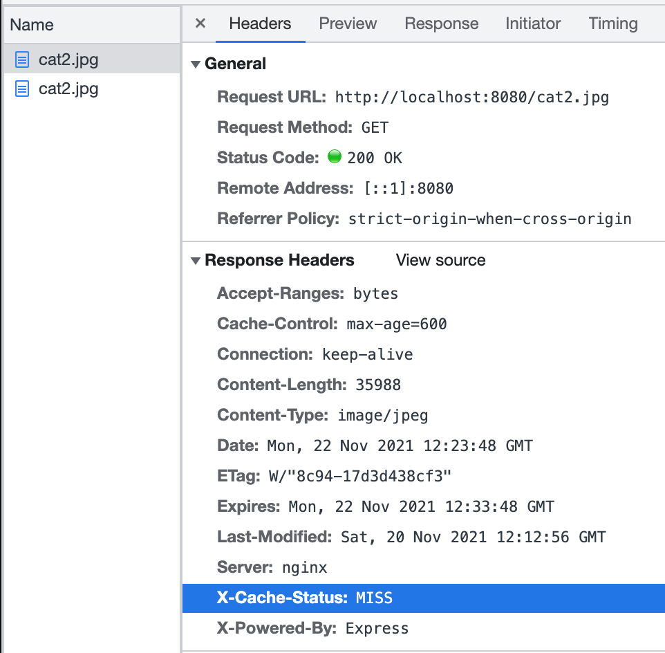
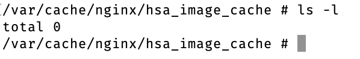
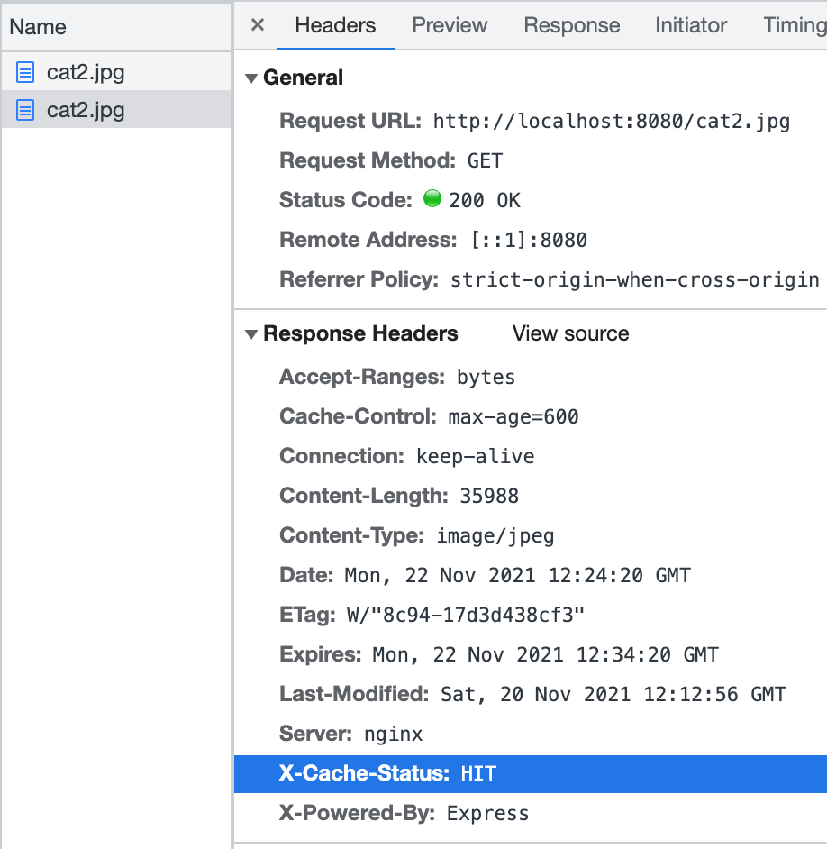
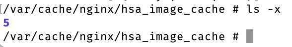
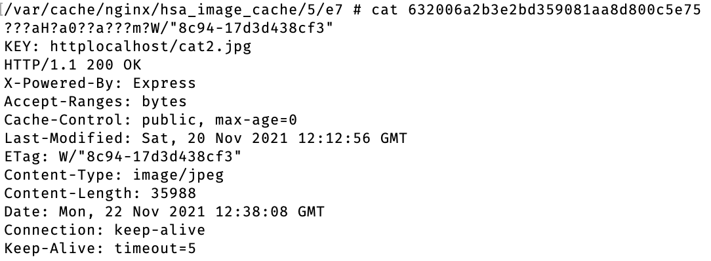
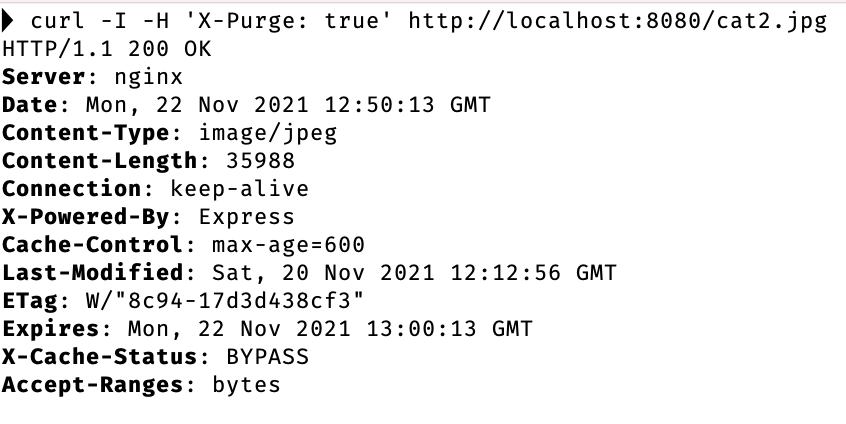
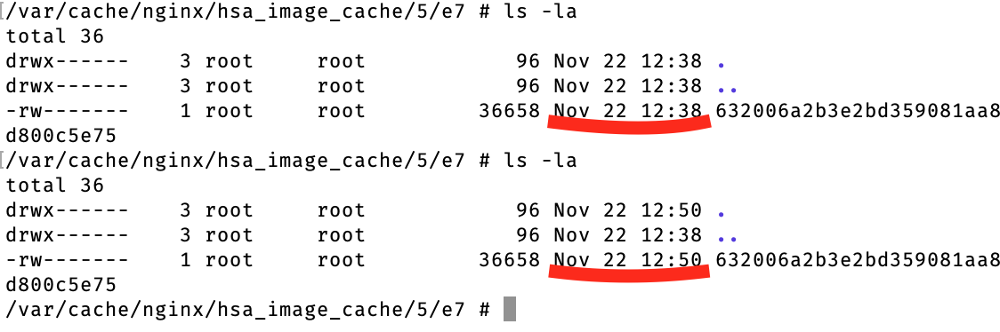
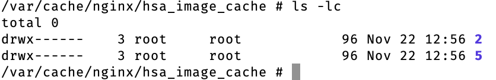
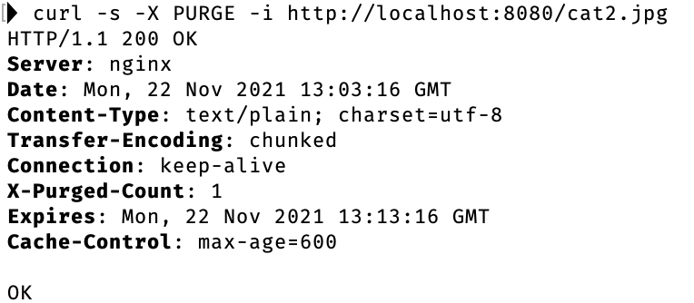
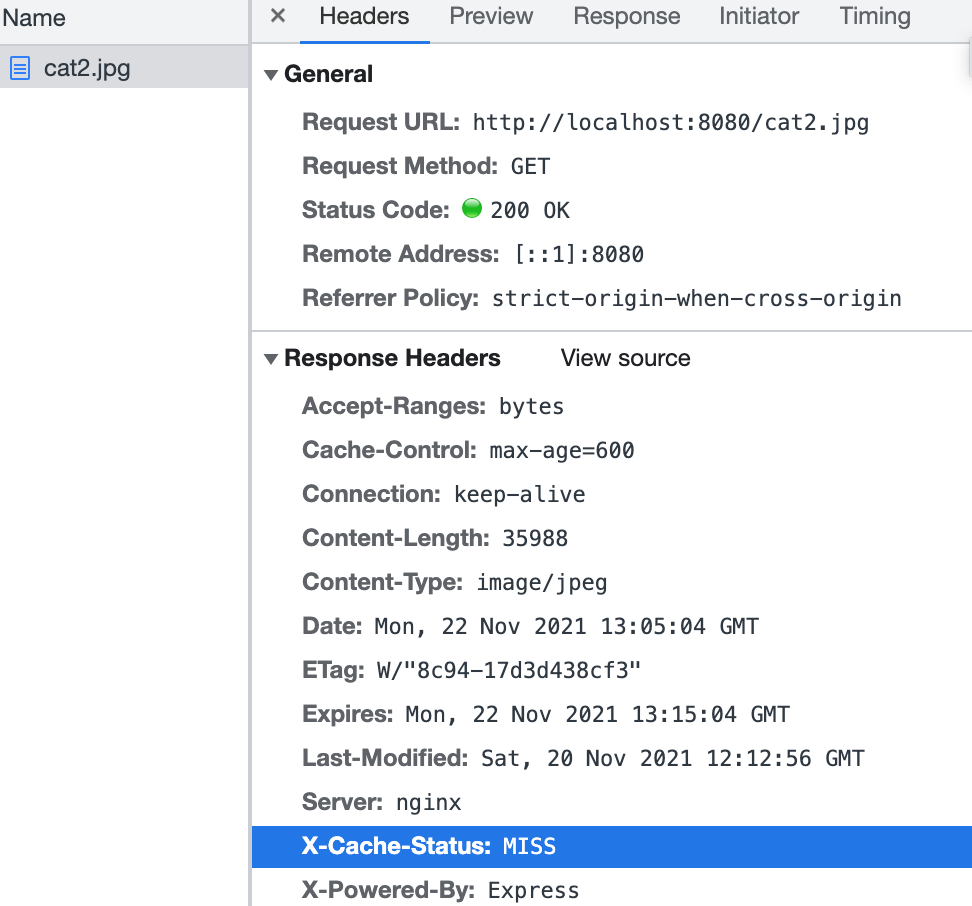

# HSA L7: Nginx Fine Tuning

## Overview
This is an example project to show how to configure nginx that will cache only images,
that were requested at least twice. Also, there is added ability to drop nginx caches by request for specific file only (not all cache).

## Getting Started
### Preparation

To demonstrate the project, we need the following tools:
1. Install ```docker```, ```bash``` and ```any browser (Firefox, Chrome or Safari)```.
2. Run the docker containers.
```bash
  docker-compose up -d
```
Be sure to use ```docker-compose down -v``` to clean up after you're done with tests.

## Test cases
1. Cache images, that were requested at least twice.

For that case you need to run next request in your browser:
```bash
  http://localhost:8080/cat2.jpg
```
First request has ```X-Cache-Status: MISS``` and the requested image isn't cached.




Second request has ```X-Cache-Status: HIT```  and the requested image is cached.




To ensure that Nginx cached exactly the image that we requested we can check the cache file:



2. Regenerate cache for an image using Bypass method.

For that case you need to run next command in your console:
```bash
curl -I -H 'X-Purge: true' http://localhost:8080/cat2.jpg
```



Cache is updated.



3. Remove cache for the specific url.
  To demonstrate the case you need to run next requests in your browser:
```bash
  http://localhost:8080/cat1.png
  http://localhost:8080/cat2.jpg
```
Here we can see that Nginx generated cache for each image.


In the next step, we will remove 'cat2.jpg' image with PURGE request. Please run next command in your console:
```bash
curl -s -X PURGE -i http://localhost:8080/cat2.jpg
```



Next image shows that cache is missed for requested image


